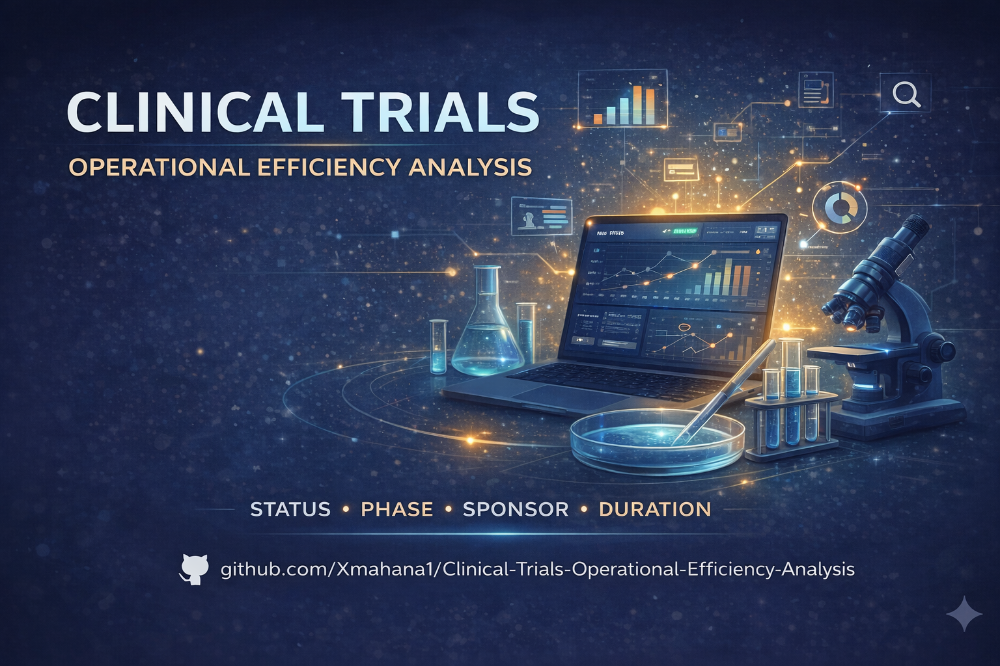

# Clinical Trials Operational Efficiency Analysis

## 📌 Overview
This project analyzes public clinical trial data to identify key operational drivers of study duration.

The objective is to understand how structural and operational factors impact clinical trial timelines and efficiency.

---

## 🎯 Objectives
- Identify factors associated with longer or shorter clinical trials  
- Analyze the impact of study status, phase, and sponsor  
- Detect operational inefficiencies  
- Generate actionable insights for optimization  

---

## 📊 Key Insights
- Study status is a major driver of duration (inactive or suspended trials last significantly longer)  
- Clinical phase strongly influences timelines  
- Study type has limited impact compared to operational factors  
- Sponsor variability suggests differences in operational complexity  

---

## 🛠️ Tools & Technologies
- Python  
- Pandas  
- Data Cleaning  
- Exploratory Data Analysis (EDA)  
- Data Visualization  

---

## 📁 Dataset
Public dataset from ClinicalTrials.gov

---

## 🚀 Project Structure
- `clinical_trials_operational_analysis.ipynb` → full analysis  
- `cover.png` → project cover image  

---

## 📈 Business Value
This analysis helps identify operational bottlenecks in clinical trials, enabling better planning, resource allocation, and efficiency improvements.

---

## 👤 Author
José Enrique Piñango  
Data Analyst | Clinical Research Enthusiast
